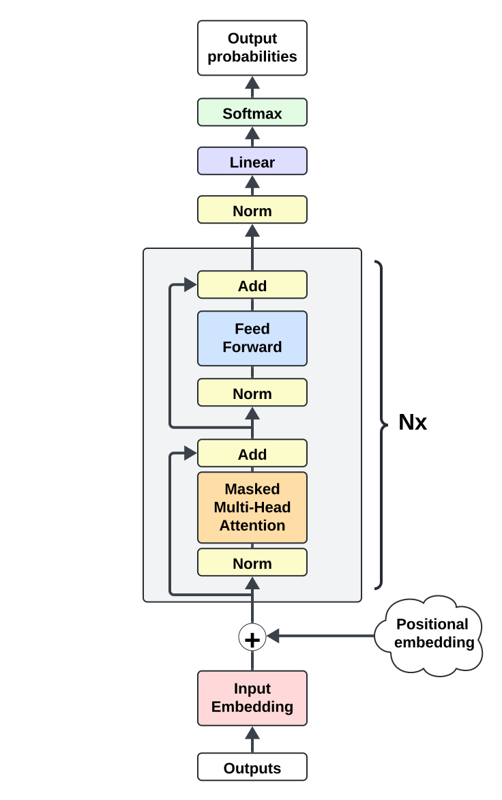

# Learned Dropout [WIP readme]
> NB: LaTeX here is optimized for Github's Markdown, so please view it on Github. Also, Safari does not render Github's LaTeX and some SVG files well, so Chrome is advised.

Dropout is a very effective yet simple regularization technique. However, its random implementation relegates it to model training only and renders it invariant to input. Here, I present LearnedDropout, a parametrized dropout that learns the best dropout for each unique input (i.e. variant to input). LearnedDropout represents a strong contender to MoE (Mixture of Experts).

## Motivations

Dropout is a very popular technique that regularizes the model training to be more robust against overfitting and thus yielding improved generalization. It simply works by randomly setting some values of a tensor to zero, with the ratio of zero values determined by a hyperparameter. When a value is set to zero, it becomes effectively detached from the computational graph, thus all the parameters that contributed to that value won't receive gradients from it. In doing so, Dropout essentially creates a subgraph of the model, and due to the randomness, every forward pass results in a different (transient) subgraph. Then, the final pre-trained model becomes the ensemble of all the different subgraphs Dropout created. Furthermore, observe that this outcome is not so conceptually removed from MoE's outcome. Each subgraph can be loosely though of an expert, so Dropout also (very weakly) partitions the model into different experts, like MoE.

Yet, unlike MoE, the random implementation means that 1) it cannot be used during inference and 2) it is invariant to input. 1) limits the benefit of Dropout to pre-training only. 2) is one big reason why MoE yields better performance than Dropout. To overcome this, Dropout needs to be parametrized to enable the model to learn the best dropout for every input. Only then will dropout become a strong competitor to MoE.

## Architecture

At the high-level, the architecture consists of a canonical decoder-only transformer with a modified dropout module. Additional dropout losses are introduced to coerce dropout towards certain characteristics.

  

