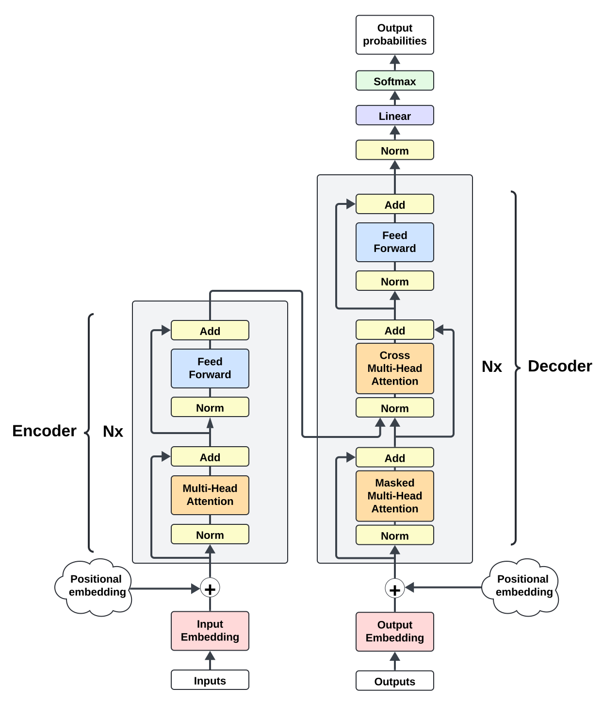
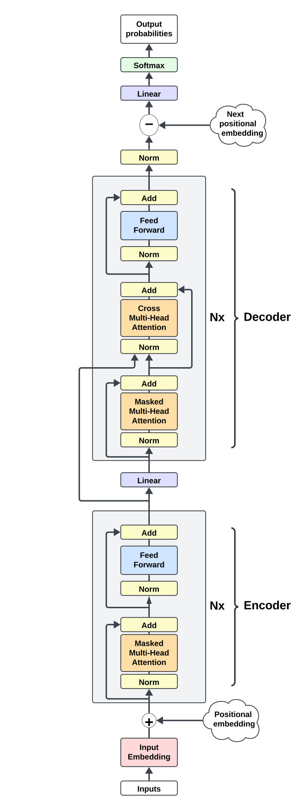
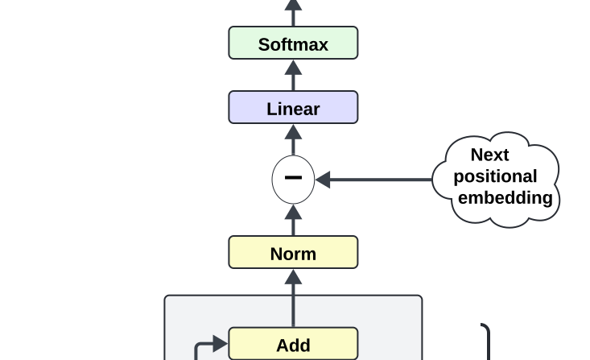

# Auto-regressive Encoder-Decoder Transformer
> NB: LaTeX here is optimized for Github's Markdown, so please view it on Github. Also, Safari does not render Github's LaTeX and some SVG files well, so Chrome is advised. Alternatively, you can view the [PDF format](README.pdf).

Virtually all SOTA LLMs are decoder-only transformer models. Here, a new end-to-end auto-regressive encoder-decoder transformer is presented that outperforms, with fewer parameters, the canonical decoder-only transformer.

## Motivations

Though transformer models have a singular objective function (next token prediction), the attention mechanism implicitly introduces another one: general (contextual) understanding. Indeed, empirical evidence shows that the earlier layers of a model focus more on general linguistic features (when applied to language), and the later layers focus more on task-specific features and thus more on prediction. In a decoder-only transformer, the model learns when to switch from understanding to predicting. In an encoder-decoder model, the switch is more imposed by design: the encoder generates an output and the decoder has to continuously attend to the encoder output. Therefore, the encoder focuses more on understanding, and the decoder more on prediction. I was interested to discover how an encoder-decoder model would fare on auto-regressive language generation.

The canonical encoder-decoder transformer is used for sequence-to-sequence tasks, like machine translation. Instead, the model here is used auto-regressively end-to-end. This, along with novel components described in sections that follow, beats – with fewer parameters – the baseline of a decoder-only transformer.

## Architecture

At the high level, the architecture follows the canonical encoder-decoder model but is applied to auto-regressive language generation. Furthermore, an additional "embedding" loss and a positional embedding operation demonstrate improved performance.

### Encoder-Decoder

In the canonical encoder-decoder transformer, the encoder runs once on an input, and the decoder runs auto-regressively on its own output while attending to the encoder output. It looks like the figure below.

<div align="center">
  
</div>
<br>

To use this architecture for an end-to-end auto-regressive task, the encoder and decoder are adapted to run serially on each new model input. The encoder generates an output and the decoder generates the next token while attending to the encoder output. When a new input is formed with the last decoder output, it gets fed back to the model, which reruns the encoder and decoder. To make this work, the encoder's attention has to be causally masked. The new architecture is shown in the figure below.

<div align="center">
    
</div>
<br>

Stated alternatively, the new architecture takes a regular decoder-only architecture with $L$ layers and makes the last $L_{decoder}$ layers perform both self-attention and cross-attention on the output of the first $L_{encoder}$ layers. 

When transitioning from encoder to decoder, the input to the first decoder layer is generated by a linear pass on the encoder output. For simplicity, the new architecture consists of an equal number of encoder and decoder layers.

### Positional embedding subtraction

Before the (decoder) output layer, the positional embedding of the "next tokens" is subtracted from the latent representations.

<div align="center">
    
</div>

The idea here is similar to weight tying of token embedding but for positional embedding. By subtracting positional embedding, the update frequency & magnitude of positional weights is increased. When coupled with token embedding weight tying, this should improve latent separation between token and positional embedding (i.e. more contrastive learning).

Another related benefit is the following (this assumes usage of weight tying of output layer with token embedding, which is true in this model). Remember that any hidden state $h_t$ carries positional information. This stems from the use of positional embedding in creating the model input embeddings $E$, the input of the first hidden layer. Moreover, because $h_t$ is exposed to $\\{h_i \mid 1 \leq i < t\\}$ via the attention mechanism and positional information is important for good contextual understanding, the attention mechanism and other model operations should also carry forward the positional information. Yet, due to output layer weight tying, the final hidden state $h_t$ is expected to exhibit the greatest affinity with the next token embedding only. Since $h_t$ carries positional information, $h_t$ presumably needs to remove or suppress it when approaching the output layer. By explicitly subtracting the positional embedding before the output layer, such burden should be lifted, and more compute can be spent elsewhere. Results validate this intuition below.

### Embedding loss

In the canonical decoder-encoder model, the loss function is evaluated over the decoder's output (itself being a function of the encoder's output). In this implementation, a new loss over the model input embeddings $E$ is introduced, in addition to the regular (decoder) loss. Again, the idea here is similar to weight tying the output layer with the token embedding (and to the positional embedding subtraction above). Weight tying increases update frequency & magnitude of embedding weights, which then better compresses the entire forward pass into embedding weights. Ultimately, this permits hidden layers to compute more complex representations. The same effect can be achieved on token weights (in addition to output layer weight tying) **and on positional weights** with the embedding loss described as follows.

Since the encoder better captures contextual understanding, the encoder output may be interpreted as representing contextual embeddings. Furthermore, observe that all the transformations that occur in the encoder amount to an aggregation of the model input embeddings in a different latent space. Therefore, it is reasonable to expect some affinity between the encoder output and a more direct aggregation of the model input embeddings. This affinity is precisely what the embedding loss maximizes, or in minimization terms, it minimizes the disaffinity.

There are many ways to directly aggregate model input embeddings to generate contextual embeddings, but the simplest is the mean operator. Given the full embedding (token + positional) $E$ of the model input and encoder output $out_{enc}$, they are both first normalized with separate LayerNorm operations to become $E_{ln}$ and $out_{enc\\\_ln}$, respectively. Crucially, the LayerNorm normalization of $E$ before the averaging does allow the model to learn a non-uniform aggregation of $E$. Then, the model computes the cumulative average of $E_{ln}$ along the token dimension (i.e. T dimension). Finally, the embedding loss is calculated as a disaffinity score between the cumulative average and the encoder output. Stated more formally,

$$
\begin{aligned}
& out_{enc} \coloneqq \text{encoder output (detached)} \\
& E \coloneqq \text{model input embedding, comprised of token and positional embedding} \\
& E_{ln} = LayerNorm_{a}(E)\\
& out_{enc\\\_ln} = LayerNorm_{b}(out_{enc})\\\\[0.5cm]
& E_{avg\\\_sum} \coloneqq \text{cumulative average of }E_{ln}\text{ along T dimension, where } E_{avg\\\_sum_{(i,j)}} = \frac{1}{i} \sum_{k=1}^{i}E_{ln_{(k,j)}} \\
& embedding\\\_loss = disaffinity\\\_score(out_{enc\\\_ln}, E_{avg\\\_sum})
\end{aligned}
$$

Note that $out_{enc}$ is detached because embedding loss is only interested in updating embedding weights.

Two disaffinity scores are considered. One is mean squared error, and the other is cosine dissimilarity. Cosine dissimilarity is cosine similarity normalized such that zero represents the most similarity and 1 most dissimilarity. So the embedding loss with MSE is given by

$$embedding\\\_loss = MSE(out_{enc\\\_ln}, E_{avg\\\_sum})$$

and the embedding loss with cosine dissimilarity is given by

$$embedding\\\_loss = 1- \frac{cosine\\\_similarity(out_{enc\\\_ln}, E_{avg\\\_sum}) + 1}{2}$$

## Results

> All training runs below were done on a [wikipedia dataset](../datasets/wikipedia/) for 9k steps on a single A100 GPU, unless otherwise stated.
> 
> Implementation of decoder-only transformer model (baseline) can be found in the [`baseline_transformer`](../baseline_transformer/) directory in this repo

The MSE embedding loss performed better than cosine dissimilarity in validation loss but worse in train loss. Both types of embedding loss performed better than an equivalent model without embedding loss.

<div>
  <div style="display: flex; flex-wrap: wrap; justify-content: space-between; align-items: flex-start; align-content: flex-start;">
    
    
    
  </div>
    <div align="center">
      <em>Safari may not render the charts above. Chrome is advised.</em>
    </div>
</div>
<br>

|   | Train loss | Val loss | Embedding loss |
|---|----------|----------|----------|
| **with cosine-dissimilarity embedding loss** [(config)](#with-cosine-dissimilarity-embedding-loss) | **2.993** | 3.387 | 8.564e-9 |
| **with MSE embedding loss** [(config)](#with-mse-embedding-loss) | 2.998 | **3.385** | 4.138e-9 |
| **no embedding loss and no pos sub** [(config)](#no-embedding-loss-and-no-pos-sub) | 3.043 | 3.413 | N/A |

Adding the positional embedding subtraction strictly improved performance.

<div>
  <div style="display: flex; flex-wrap: wrap; justify-content: space-between; align-items: flex-start; align-content: flex-start;">
  
  
  </div>
    <div align="center">
      <em>Safari may not render the charts above. Chrome is advised.</em>
    </div>
</div>
<br>


|   | Train loss | Val loss | Embedding loss |
|---|----------|----------|----------|
| **with pos embed sub** [(config)](#with-pos-embed-sub) | **2.979** | **3.381** | N/A |
| **no embedding loss and no pos sub** [(config)](#no-embedding-loss-and-no-pos-sub) | 3.043 | 3.413 | N/A |


Combining both MSE embedding loss and positional embedding subtraction further improved validation loss.

<div>
  <div style="display: flex; flex-wrap: wrap; justify-content: space-between; align-items: flex-start; align-content: flex-start;">
  
  
    
  </div>
    <div align="center">
      <em>Safari may not render the charts above. Chrome is advised.</em>
    </div>
</div>
<br>

|   | Train loss | Val loss | Embedding loss |
|---|----------|----------|----------|
| **with pos embed sub** [(config)](#with-pos-embed-sub) | **2.979** | 3.381 | N/A |
| **with MSE embedding loss** [(config)](#with-mse-embedding-loss) | 2.998 | 3.385 | 4.138e-9 |
| **with MSE embedding loss and pos sub** [(config)](#with-mse-embedding-loss-and-pos-sub) | 2.982 | **3.378** | 4.673e-9 |

Compared to a canonical decoder-only transformer (baseline), the new model outperformed the baseline in validation loss but underperformed in train loss. Both completed in a similar amount of time with similar memory demands, but the baseline had more parameters.

<div>
  <div style="display: flex; flex-wrap: wrap; justify-content: space-between; align-items: flex-start; align-content: flex-start;">
  
  
  </div>
    <div align="center">
      <em>Safari may not render the charts above. Chrome is advised.</em>
    </div>
</div>
<br>

|   | Train loss | Val loss | Size (params) |
|---|----------|----------|----------|
| **with MSE embedding loss and pos sub** [(config)](#with-mse-embedding-loss-and-pos-sub) | 2.982 | **3.378** | 15,763,500 |
| **baseline** [(config)](#baseline) | **2.937** | 3.424 | 16,036,800 |

Two more baselines were compared: "smaller baseline" and "0.2 dropout baseline". "smaller baseline" was a baseline smaller (i.e. fewer parameters) than "with MSE embedding loss and pos sub". Usually, smaller models perform better in validation loss because they overfit less, so the new model's better validation loss could perhaps be explained by its smaller size. By also outperforming "smaller baseline", then the new model's better validation loss can't be attributed to any size explanation. "0.2 dropout baseline" was a baseline with 0.2 dropout. By outperforming it, the new model also demonstrated its superiority over dropout.

<div>
  <div style="display: flex; flex-wrap: wrap; justify-content: space-between; align-items: flex-start; align-content: flex-start;">
  
  
  </div>
    <div align="center">
      <em>Safari may not render the charts above. Chrome is advised.</em>
    </div>
</div>
<br>

|   | Train loss | Val loss | Size (params) |
|---|----------|----------|----------|
| **with MSE embedding loss and pos sub** [(config)](#with-mse-embedding-loss-and-pos-sub) | 2.982 | **3.378** | 15,763,500 |
| **baseline** [(config)](#baseline) | **2.937** | 3.424 | 16,036,800 |
| **smaller baseline** [(config)](#smaller-baseline) | 2.958 | 3.416 | 15,441,192 |
| **0.2 dropout baseline** [(config)](#02-dropout-baseline) | 3.174 | 3.406 | 16,036,800 |

## Next steps

These are some further things to look forward to:
- experiment with unequal encoder and decoder layers, ideally allowing the model to learn the ratio
- instead of MSE and cosine dissimilarity, consider other disaffinity scores
- LayerNorm normalization of $E$ before averaging allows the model to learn non-uniform aggregation of $E$. It's worth exploring other ways of doing so, like convolution or even plain matmul
- try bigger models, at least GPT-2 size
- run training for longer to observe long-term behavior
- evaluate on different datasets
- evaluate on non-language tasks
- dropout is known to improve validation loss, but it was not used here for simplicity, except in the baseline. The new architecture should also be tested with dropout
- absolute positional embeddings are used in the model. Positional embedding subtraction should be tested with relative positional embeddings as well, like Rotary Position Embedding


## Conclusions

Even the bare-bones [no embedding loss and no pos sub](#no-embedding-loss-and-no-pos-sub) outperformed the baseline in validation loss with fewer parameters. This probably means that cross-attention on encoder output is sufficient for better performance (or at least prevents overfitting). When coupled with embedding loss and positional embedding subtraction, performance improved even more.

Moreover, it would be very interesting to inspect the effect of embedding loss and positional embedding subtraction on token and positional embeddings. Perhaps interesting relationships can be observed between token and positional embedding. Furthermore, positional embedding subtraction should work even for decoder-only transformers, and experiments should validate this.

Alas, the principal limitation is my personal compute budget, so this project cannot avail itself of further analysis and experimentation.

## Citation

If you use this codebase, or otherwise found my work valuable, please cite:

```
@misc{yan2024autoregressive-enc-dec,
  title={Auto-regressive Encoder-Decoder Transformer},
  author={Yan, Yifei},
  year={2024},
  url={https://github.com/yiphei/yif-AI/tree/main/autoregressive_encoder_decoder_transformer}
}
```

---
## Appendix
### Run configs
#### "with cosine-dissimilarity embedding loss"
```
batch_size: 50
beta1: 0.9
beta2: 0.95
decay_lr: true
est_interval: 500
est_steps: 200
gradient_accumulation_steps: 16
lr: 0.0009
lr_decay_iters: 700000
min_lr: 9.0e-05
model_config:
  add_ln_before_decoder_ff: false
  add_pos_embed_to_decoder: false
  context_size: 200
  cross_attn_config:
    n_head: 10
    use_bias: false
  detach_type: "ENCODER_OUT"
  dropout_rate: 0
  embedding_ln_type: "INIT"
  embedding_loss_coeff: 1
  embedding_loss_type: "COSINE"
  n_embed: 150
  n_head: 5
  n_layer: 13
  order_type: "ORIGINAL"
  sub_pos_embed_to_decoder: "NO"
  use_bias: false
  use_ln_on_encoder_out: true
train_steps: 9000
warmup_iters: 300
weight_decay: 0.1
 ```
#### "with MSE embedding loss"
```
batch_size: 50
beta1: 0.9
beta2: 0.95
decay_lr: true
est_interval: 500
est_steps: 200
gradient_accumulation_steps: 16
lr: 0.0009
lr_decay_iters: 700000
min_lr: 9.0e-05
model_config:
  add_ln_before_decoder_ff: false
  add_pos_embed_to_decoder: false
  context_size: 200
  cross_attn_config:
    n_head: 10
    use_bias: false
  detach_type: "ENCODER_OUT"
  dropout_rate: 0
  embedding_ln_type: "INIT"
  embedding_loss_coeff: 1
  embedding_loss_type: "MSE"
  n_embed: 150
  n_head: 5
  n_layer: 13
  order_type: "ORIGINAL"
  sub_pos_embed_to_decoder: "NO"
  use_bias: false
  use_ln_on_encoder_out: true
train_steps: 9000
warmup_iters: 300
weight_decay: 0.1
 ```
#### "no embedding loss and no pos sub"
```
batch_size: 50
beta1: 0.9
beta2: 0.95
decay_lr: true
est_interval: 500
est_steps: 200
gradient_accumulation_steps: 16
lr: 0.0009
lr_decay_iters: 700000
min_lr: 9.0e-05
model_config:
  add_ln_before_decoder_ff: false
  add_pos_embed_to_decoder: false
  context_size: 200
  cross_attn_config:
    n_head: 10
    use_bias: false
  detach_type: null
  dropout_rate: 0
  embedding_ln_type: null
  embedding_loss_coeff: null
  embedding_loss_type: "NONE"
  n_embed: 150
  n_head: 5
  n_layer: 13
  order_type: "ORIGINAL"
  sub_pos_embed_to_decoder: "NO"
  use_bias: false
  use_ln_on_encoder_out: null
train_steps: 9000
warmup_iters: 300
weight_decay: 0.1
 ```

#### "with pos embed sub"
```
batch_size: 50
beta1: 0.9
beta2: 0.95
decay_lr: true
est_interval: 500
est_steps: 200
gradient_accumulation_steps: 16
lr: 0.0009
lr_decay_iters: 700000
min_lr: 9.0e-05
model_config:
  add_ln_before_decoder_ff: false
  add_pos_embed_to_decoder: false
  context_size: 200
  cross_attn_config:
    n_head: 10
    use_bias: false
  detach_type: null
  dropout_rate: 0
  embedding_ln_type: null
  embedding_loss_coeff: null
  embedding_loss_type: "NONE"
  n_embed: 150
  n_head: 5
  n_layer: 13
  order_type: "ORIGINAL"
  sub_pos_embed_to_decoder: "YES_NO_LN"
  use_bias: false
  use_ln_on_encoder_out: null
train_steps: 9000
warmup_iters: 300
weight_decay: 0.1
```
#### "with MSE embedding loss and pos sub"
```
batch_size: 50
beta1: 0.9
beta2: 0.95
decay_lr: true
est_interval: 500
est_steps: 200
gradient_accumulation_steps: 16
lr: 0.0009
lr_decay_iters: 700000
min_lr: 9.0e-05
model_config:
  add_ln_before_decoder_ff: false
  add_pos_embed_to_decoder: false
  context_size: 200
  cross_attn_config:
    n_head: 10
    use_bias: false
  detach_type: "ENCODER_OUT"
  dropout_rate: 0
  embedding_ln_type: "INIT"
  embedding_loss_coeff: 8
  embedding_loss_type: "MSE"
  n_embed: 150
  n_head: 5
  n_layer: 13
  order_type: "ORIGINAL"
  sub_pos_embed_to_decoder: "YES_NO_LN"
  use_bias: false
  use_ln_on_encoder_out: true
train_steps: 9000
warmup_iters: 300
weight_decay: 0.1
 ```
#### "baseline"
```
batch_size: 50
beta1: 0.9
beta2: 0.95
decay_lr: true
est_interval: 500
est_steps: 200
gradient_accumulation_steps: 16
lr: 0.0009
lr_decay_iters: 700000
min_lr: 9.0e-05
model_config:
  context_size: 200
  dropout_rate: 0
  n_embed: 160
  n_head: 10
  n_layer: 26
  use_bias: false
train_steps: 9000
warmup_iters: 300
weight_decay: 0.1
```
#### "smaller baseline"
```
batch_size: 50
beta1: 0.9
beta2: 0.95
decay_lr: true
est_interval: 500
est_steps: 200
gradient_accumulation_steps: 16
lr: 0.0009
lr_decay_iters: 700000
min_lr: 9.0e-05
model_config:
  context_size: 200
  dropout_rate: 0
  n_embed: 156
  n_head: 12
  n_layer: 26
  use_bias: false
train_steps: 9000
warmup_iters: 300
weight_decay: 0.1
```
#### "0.2 dropout baseline"
```
batch_size: 50
beta1: 0.9
beta2: 0.95
decay_lr: true
est_interval: 500
est_steps: 200
gradient_accumulation_steps: 16
lr: 0.0009
lr_decay_iters: 700000
min_lr: 9.0e-05
model_config:
  context_size: 200
  dropout_rate: 0.2
  n_embed: 160
  n_head: 10
  n_layer: 26
  use_bias: false
train_steps: 9000
warmup_iters: 300
weight_decay: 0.1
```