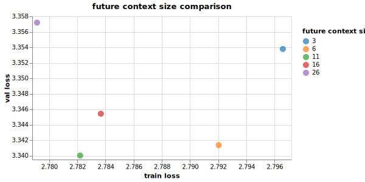

# DeepSight (WIP)
> NB: LaTeX here is optimized for Github's Markdown, so please view it on Github. Also, Safari does not render Github's LaTeX and some SVG files well, so Chrome is advised.

Virtually all autoregressive transformer models are trained with the singular objective of next token prediction. They don't possess an explicit objective to think – or better, plan – beyond the next token (though they implicitly do). Here, I present a new transformer model, DeepSight, that includes an explicit objective of planning beyond the next token, in addition to next token prediction. DeepSight beats, with fewer parameters, a canonical decoder-only transformer, both in train and validation loss.

## Motivations

Despite being trained on next token prediction, autoregressive transformer models do develop abilities to plan beyond the next token via the attention mechanism. Yet, this ability is rather weak and many failure modes can be attributed to this weakness. Note that I restrict planning to whatever happens within a forward pass. Indeed, models can exhibit better planning at the prompt level once you introduce chaining or other clever orchestration logic. 

This project explores how planning many steps beyond the next token can be formulated as an objective function during training, in addition to the regular next token prediction. Why planning? The (perhaps antropomorphic) intuition is that deliberate planning can improve downstream next token prediction. After all, planning for $n$ future tokens includes the next token. Why as new objective function though? Because that is perhaps the easiest and best way to induce any model behavior.

## Architecture

At the high level, the architecture consists of an encoder-decoder transformer adapted for end-to-end autoregressive tasks (for those who have read my other model *Auto-regressive Encoder-Decoder Transformer*, it shares the same core architecture but it doesn't have the positional embedding subtraction). The encoder-decoder separation is necessary to the formulation of the planning objective.

### Encoder-Decoder

> This section reiterates verbatim the respective section in *Auto-regressive Encoder-Decoder Transformer*. You can skip it if you have already read that one

In the canonical encoder-decoder transformer, the encoder runs once on an input, and the decoder runs auto-regressively on its own output while attending to the encoder output. It looks like the figure below.

  

 

To use this architecture for an end-to-end auto-regressive task, the encoder and decoder are adapted to run serially on each new model input. The encoder generates an output and the decoder generates the next token while attending to the encoder output. When a new input is formed with the last decoder output, it gets fed back to the model, which reruns the encoder and decoder. To make this work, the encoder's attention has to be causally masked. The new architecture is shown in the figure below.

    

 

Stated alternatively, the new architecture takes a regular decoder-only architecture with $L$ layers and makes the last $L_{decoder}$ layers perform both self-attention and cross-attention on the output of the first $L_{encoder}$ layers. 

When transitioning from encoder to decoder, the input to the first decoder layer is generated by a linear pass on the encoder output. For simplicity, the new architecture consists of an equal number of encoder and decoder layers.

### Planning loss

To improve the model's planning abilities, an explicit planning objective function must be added. To this end, planning must be first expressed as an output that the model can generate. Remember that transformers are excellent at contextual understanding. Normally, the contextual understanding of any hidden state $h_{t}$ spans the tokens $\\{x_i \mid 1 \leq i \leq t\\}$. Under this paradigm, the simplest and most natural way to introduce planning is to express it as an extension of understanding that includes future tokens as well. Thus, good planning is defined as predicting well the latent representation $h^{*}\_{t}$ that captures the contextual understanding of $\\{x_i \mid 1 \leq i \leq t+\delta\\}$, where $\delta$ is a scalar hyperparameter. Let's call the context encompassing $\\{x_i \mid 1 \leq i \leq t+\delta\\}$ the **planning context**, of which $\\{x_i \mid 1 \leq i \leq t\\}$ is the **present context** and $\\{x_i \mid t+1 \leq i \leq t+\delta\\}$ is the **future context**. $\delta$ may be called future context size. Note that this planning definition doesn't imply that the future becomes somewhat exposed to the present (e.g. by removing the causal mask in attention), rather that it becomes part of an objective that the model maximizes.

Next, let's proceed to the three components of any objective function: model output, ground truth, and a minimization function.

On model output, first note that it is hard to make one output fulfill two predictive functions, so a different output than the one used for next token prediction is needed. Furthermore, this output must be used by the model to produce the downstream next token prediction output, so it must play an important role in the latter's computational graph. In a decoder-only transformer, the choice is essentially a hidden state, which is too transient. Alternatively, something more complicated is possible but runs the risk of bloating the model and hindering the gradient flow. However, in an encoder-decoder transformer, there are two natural distinct outputs, and the decoder attends to the encoder output in every single decoder layer. Moreover, since the encoder focuses more on understanding and decoder more on predicting next token, the encoder becomes the natural place to expect planning to happen. Therefore, the encoder output is selected as the model output of the planning objective function.

Next, generating the ground truth of planning contexts is needed. Since the encoder output is selected, observe that all the transformations that occur in encoder layers amount to an aggregation of the model input embeddings in a different latent space. This aggregation forms the basis of (present) contextual understanding. Hence, one can expect an affinity between encoder output and a more direct agggregation of the model input embeddings. Given the planning objective function, this affinity can be extended to include future model input embeddings as well. This affinity is precisely what the objective function maximizes, or in minimization terms, it minimizes the disaffinity. 

Consequently, the ground truth can be generated as planning context embeddings. First, generate present and future context embeddings through cumulative aggregation of model input embeddings. Then, aggregate these two to form planning context embeddings. There are many ways of doing these cumulative aggregations. Here, two different aggregation weightings are used for present and future. The present context embeddings are cumulatively aggregated with the mean operator. The future context embeddings are cumulatively aggregated with a decaying factor, to reflect the intution that near future tokens are easier to predict than distant future ones. Next, the planning context embeddings average present and future context embeddings. Finally, both encoder output and planning context embeddings are normalized with separate LayerNorm layers, and their disaffinity score becomes the planning loss. Stated more formally,

$$
\begin{aligned}
& \delta \coloneqq \text{hyperparameter for how many future tokens the model should plan for, inclusive of next token} \\
& out_{enc} \coloneqq \text{encoder output} \\
& E \coloneqq \text{model input embedding (detached), comprised of token and positional embedding} \\
& E_{present} \coloneqq \text{cumulative average of }E\text{ along T dimension, where } E_{present_{(i,j)}} = \frac{1}{i} \sum_{k=1}^{i}E_{k,j}\\\\[0.2cm]
& E_{future} \coloneqq \text{cumulative aggregation of }E\text{ along T dimension, where } E_{future_{(i,j)}} = \sum_{k=1}^{\delta}k^{-1}\cdot E_{i+k,j}\\\\[0.5cm]
& E_{plan} = \frac{E_{present} +  E_{future}}{2} \\
& E_{plan\\\_ln} = LayerNorm(E_{plan}) \\
& out_{enc\\\_ln} = LayerNorm(out_{enc}) \\
& planning\\\_loss = disaffinity\\\_score(out_{enc\\\_ln}, E_{plan\\\_ln})
\end{aligned}
$$

Note that $E$ is first detached because it is used to construct the ground truth. However, because the embedding weights of $E$ are not frozen and thus change, $E_{plan}$ must be re-computed at every forward pass. Perhaps calling $E_{plan}$ ground truth is a bit of a misnomer.

Two disaffinity scores are considered. One is mean squared error, and the other is cosine dissimilarity. Cosine dissimilarity is cosine similarity normalized such that zero represents the most similarity and 1 most dissimilarity. So the planning loss with MSE is given by

$$planning\\\_loss = MSE(out_{enc\\\_ln}, E_{plan\\\_ln})$$

and the planning loss with cosine dissimilarity is given by

$$planning\\\_loss = 1- \frac{cosine\\\_similarity(out_{enc\\\_ln}, E_{plan\\\_ln}) + 1}{2}$$

#### A note on $E_{future}$

Observe the upper bound term $\delta$ of 

$$
\begin{aligned}
& E_{future_{(i,j)}} = \sum_{k=1}^{\delta}k^{-1}\cdot E_{i+k,j}
\end{aligned}
$$

When $i > context\\\_size - \delta$, an index out of bounds error will occur. To handle this, there are two options. The first is to change the training code such that the input data $X$ becomes of length $|X| = context\\\_size+\delta$ tokens but the expected output length remains $|Y| = context\\\_size$, for each batch. Thus, the additional $\delta$ tokens simply serve to satisfy $E_{future}$ but no next token output is expected of them. Consequentially, the positional embeddings of the additional $\delta$ tokens won't ever be updated because $E$ is detached for the planning loss (this assumes absolute positional embeddings, which are used in this model; it may be different with relative positional embeddings).

The second option is to just ignore tokens $\\{x_i \mid context\\\_size - \delta < i \leq context\\\_size\\}$ for the planning loss, meaning there will be only $|context\\\_size - \delta|$ planning context embeddings evaluated for the planning loss. Doing so essentially limits the lenght (i.e. T dimension) of $E_{present}$, $E_{future}$, $E_{plan}$ and $out_{enc}$ to $|context\\\_size - \delta|$. This second option is chosen for simplicity.

## Results

> All training runs below were done on a wikipedia dataset for 9k steps on a single A100 GPU, unless otherwise stated.
> 
> Implementation of decoder-only transformer model (baseline) can be found in the `baseline_transformer` directory in this repo

The MSE embedding loss performed better than cosine dissimilarity in both validation and train loss. MSE outperformed an equivalent model without embedding loss. Cosine dissimilarity outperformed an equivalent model without embedding loss in train loss and slightly underperformed in val loss. MSE and cosine dissimilarity both had $\delta = 11$

  

    
    
    
  

    

      <em>Safari may not render the charts above. Chrome is advised.</em>
    

 

|   | Train loss | Val loss | Planning loss |
|---|----------|----------|----------|
| **FCS=11 Cosine** [(config)](#) | 2.788 | 3.353| 6.999e-9 |
| **FCS=11 MSE** [(config)](#) | **2.782** | **3.34** | 4.841e-9 |
| **no planning loss** [(config)](#) | 2.809 | 3.352 | N/A |

Next, the model was tested on different future context sizes. Better train loss performance is correlated with bigger future context size. Val loss is not very correlated.

  

    
  

    

      <em>Safari may not render the charts above. Chrome is advised.</em>
    

 

|   | Train loss | Val loss | Planning loss |
|---|----------|----------|----------|
| **FCS=3 MSE** [(config)](#) | 2.797 | 3.354| 5.855e-9 |
| **FCS=6 MSE** [(config)](#) | 2.792 | 3.341| 5.082e-9 |
| **FCS=11 MSE** [(config)](#) | 2.782 | **3.34** | 4.841e-9 |
| **FCS=16 MSE** [(config)](#) | 2.784 | 3.345| 5.028e-9 |
| **FCS=26 MSE** [(config)](#) | **2.779** | 3.357| 5.057e-9 |

Compared to a canonical decoder-only transformer (baseline), the new model outperformed the baseline in validation and train loss. Both completed in a similar amount of time with similar memory demands, but the baseline had more parameters.

  

  
  
  

    

      <em>Safari may not render the charts above. Chrome is advised.</em>
    

 

|   | Train loss | Val loss | Size (params) |
|---|----------|----------|----------|
| **with MSE embedding loss and pos sub** [(config)](#) | **2.782** | **3.34** | 15,763,500 |
| **baseline** [(config)](#) | 2.789 | 3.391 | 16,036,800 |

## Next steps

These are some further things to look forward to:
- remove the $\delta$ hyperparameter and let the model learn the best planning horizon
- explore other ways of constructing present, future, and planning context embeddings, like convolution or even plain matmul. Ideally, the model learns the best aggregation weights
- experiment with unequal encoder and decoder layers, ideally allowing the model to learn the ratio
- instead of MSE and cosine dissimilarity, consider other disaffinity scores
- try bigger models, at least GPT-2 size
- run training for longer to observe long-term behavior
- try different datasets
- try it on non-language tasks
- using relative positional embeddings like Rotary Position Embedding, instead of absolute ones, should make option one in [A note on $E_{future}$](#a-note-on-e_future) more palatable

## Conclusions

---
## Appendix
### Run configs
TODO