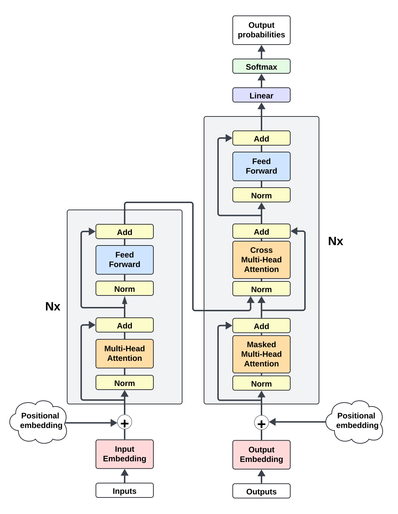
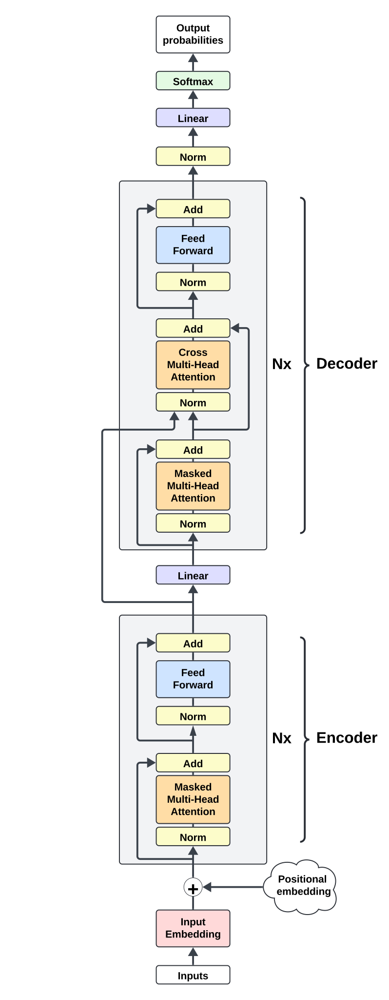

# DeepSight (WIP)
> NB: LaTeX here is optimized for Github's Markdown, so please view it on Github. Also, Safari does not render Github's LaTeX well, so Chrome is advised.

Virtually all autoregressive transformer models are trained with the singular objective of next token prediction. They don't possess an explicit objective to think – or better, plan – beyond the next token (though they implicitly do). Here, I present a new transformer model, DeepSight, that includes an explicit objective of planning beyond the next token, in addition to next token prediction. DeepSight beats, with fewer parameters, a canonical decoder-only transformer, both in train and validation loss.

## Motivations

Despite being trained on next token prediction, autoregressive transformer models do develop abilities to plan beyond the next token because of the attention mechanism. Yet, this ability is rather weak and many failure modes can be attributed to this weakness. Note that I restrict planning to whatever happens within a forward pass. Indeed, models can exhibit better planning at the prompt level once you introduce chaining or other clever orchestration logic. 

This project explores how planning many steps beyond the next token can be formulated as an objective function during training, in addition to the regular next token prediction. Why planning? The (perhaps antropomorphic) intuition is that deliberate planning can improve downstream next token prediction. After all, planning for $n$ future tokens includes the next token. Why as new objective function though? Because that is the easiest and best way to induce any model behavior.

## Architecture

At the high level, the architecture consists of an encoder-decoder transformer adapted for end-to-end autoregressive tasks (for those who have read my other model *Auto-regressive Encoder-Decoder Transformer*, it shares the same core architecture). The encoder-decoder separation is necessary to the formulation of the planning objective.

### Encoder-Decoder

> This section reiterates the respective section in *Auto-regressive Encoder-Decoder Transformer*. You can skip it if you have already read that one

In the canonical encoder-decoder transformer, the encoder runs once on an input, and then the decoder runs auto-regressively on its own output while attending to the encoder output. It looks like this

  

 

To use this architecture for an end-to-end auto-regressive task, the encoder and decoder are adapted to run serially on each new model input. The encoder generates an output and the decoder generates the next token while attending to the encoder output. When a new input is formed with the last decoder output, it gets fed back to the model, which reruns the encoder and decoder. To make this work, the encoder's attention has to be masked. The new architecture is shown in the figure below.

    

 

Stated alternatively, the new architecture takes a regular decoder-only architecture with $L$ layers and makes the last $L_{decoder}$ layers perform both self-attention and cross-attention on the output of the first $L_{encoder}$ layers. 

When transitioning from encoder to decoder, the input to the first decoder layer is generated by a linear pass on the encoder output. For simplicity, the new architecture consists of an equal number of encoder and decoder layers.

### Future loss

To improve the model's planning abilities, an explicit planning objective function must be added. To this end, planning must be first expressed as an output that the model can predict. Remember that transformers are excellent at contextual understanding. Normally, the contextual understanding of any hidden state $h_{t}$ spans from token $x_t$ to $x_1$. Under this paradigm, the easiest and most natural way to introduce planning is to express it as an extension of understanding that includes future tokens as well. Thus, good planning is defined as predicting well the latent representation that captures the contextual understanding from token $x_1$ to $x_{t+n}$, where $n$ is a hyperparameter. Note that this doesn't mean that the future becomes somewhat exposed to the present (e.g. by removing the causal mask in attention), rather that it becomes an objective that the model maximizes. 

With this definition, let's proceed to the three components of the planning objective function: 1) model output, 2) ground truth, and 3) a minimization function.

For 1), first note that it is hard to make one output fulfill two predictive functions, so a different output than the one used for next token prediction is needed. Furthermore, this output must be used by the model to produce the downstream next token prediction output, so it must play an important role in the latter's computational graph. In a decoder-only transformer, the choice is basically a hidden state, which is too transient. Alternatively, something more complicated is possible but runs the risk of bloating the model and hindering the gradient flow. However, in an encoder-decoder transformer, there are two natural distinct outputs, and the decoder attends to the encoder output in every single layer. Furthermore, since the encoder focuses more on understanding and decoder more on predicting next token, the encoder becomes the natural place where to expect planning to happen. Therefore, the encoder output is selected as the model output for the planning objective function.

For 2), it requires generating ground truth for these "future" contexts. Since the encoder output is chosen, observe that all the transformations that occur in encoder layers amount to an aggregation of the model input embeddings in a different latent space. This aggregation forms the basis of contextual understanding. Hence, we can expect an affinity between encoder output and a more direct agggregation of the model input embeddings. Given the planning objective function, this affinity can be extended to include future model input embeddings as well. This affinity is precisely what the objective function tries to maximize, or in minimization terms, it tries to minimize the disaffinity. Armed with this knowledge, we can create the ground truth by aggregating present and future model input embeddings into a single contextual embedding that captures $x_1$ to $x_{t+n}$. There are many ways to do so, and in the implementation here, two different aggregation weightings were used. The present context (from $x_1$ to $x_t$) was aggregated via a simple average. The future context was aggregated with a decaying factor, to reflect the intution that near future tokens are easier to predict than distant future ones. Then, the final full context averages present and future contexts. Stated more formally,

$$
\begin{aligned}
& out_{enc} \coloneqq \text{encoder output} \\
& E \coloneqq \text{model input embedding (detached), comprised of token and positional embedding} \\
& n \coloneqq \text{hyperparameter for how many future tokens the model should plan for, inclusive of next token} \\
& out_{enc\\\_ln} = LayerNorm(out_{enc})\\\\[0.5cm]
& E_{present\\\_aggr} \coloneqq \text{cumulative average of }E\text{ along T dimension, where } E_{present\\\_aggr_{(i,j)}} = \frac{1}{i} \sum_{z=0}^{i}E_{z,j}\\\\[0.2cm]
& E_{future\\\_aggr} \coloneqq \text{cumulative aggregation of }E\text{ along T dimension, where } E_{future\\\_aggr_{(i,j)}} = \sum_{z=1}^{z+n-1}z^{-1}\cdot E_{i+z,j} \\
& E_{full} = \frac{E_{present\\\_aggr} +  E_{future\\\_aggr}}{2} \\
& E_{full\\\_ln} = LayerNorm(E_{full}) \\
& future\\\_loss = disaffinity\\\_score(out_{enc\\\_ln}, E_{full\\\_ln})
\end{aligned}
$$

Note that neither the embedding weights (both token and positional) nor the encoder weights are frozen, so these future contextual embeddings must be computed at every forward pass because they can change. So perhaps calling them ground truth is a bit of a misnomer.

Once the future contexts are constructed, then the objective function is defined as a disaffinity score between future contexts and encoder output. Two disaffinity scores are considered. One is mean squared error, and the other is cosine dissimilarity. Cosine dissimilarity is cosine similarity normalized such that zero represents the most similarity and 1 most dissimilarity. So the embedding loss with MSE is just

$$future\\\_loss = MSE(out_{enc\\\_ln}, E_{full\\\_ln})$$

and the embedding loss with cosine dissimilarity is

$$future\\\_loss = 1- \frac{cosine\\\_similarity(out_{enc\\\_ln}, E_{full\\\_ln}) + 1}{2}$$

## Results

> All training runs below were done on a wikipedia dataset for 9k steps on a single A100 GPU, unless otherwise stated.
> 
> Implementation of decoder-only transformer model (baseline) can be found in the `baseline_transformer` directory in this repo

## Next steps

These are some further things to look forward to:
TODO

## Conclusions

---
## Appendix
### Run configs
TODO