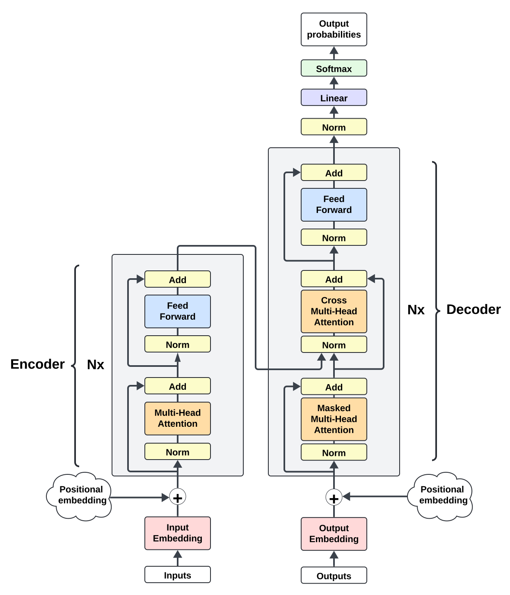

# DeepSight (WIP)
> NB: LaTeX here is optimized for Github's Markdown, so please view it on Github. Also, Safari does not render Github's LaTeX well, so Chrome is advised.

Virtually all autoregressive transformer models are trained with the singular objective of next token prediction. They don't possess an explicit objective to think – or better, plan – beyond the next token (though they implicitly do). Here, I present a new transformer model, DeepSight, that includes an explicit objective of planning beyond the next token, in addition to next token prediction. DeepSight beats, with fewer parameters, a canonical decoder-only transformer, both in train and validation loss.

## Motivations

Despite being trained on next token prediction, autoregressive transformer models do develop abilities to plan beyond the next token via the attention mechanism. Yet, this ability is rather weak and many failure modes can be attributed to this weakness. Note that I restrict planning to whatever happens within a forward pass. Indeed, models can exhibit better planning at the prompt level once you introduce chaining or other clever orchestration logic. 

This project explores how planning many steps beyond the next token can be formulated as an objective function during training, in addition to the regular next token prediction. Why planning? The (perhaps antropomorphic) intuition is that deliberate planning can improve downstream next token prediction. After all, planning for $n$ future tokens includes the next token. Why as new objective function though? Because that is perhaps the easiest and best way to induce any model behavior.

## Architecture

At the high level, the architecture consists of an encoder-decoder transformer adapted for end-to-end autoregressive tasks (for those who have read my other model *Auto-regressive Encoder-Decoder Transformer*, it shares the same core architecture). The encoder-decoder separation is necessary to the formulation of the planning objective.

### Encoder-Decoder

> This section reiterates the respective section in *Auto-regressive Encoder-Decoder Transformer*. You can skip it if you have already read that one

In the canonical encoder-decoder transformer, the encoder runs once on an input, and then the decoder runs auto-regressively on its own output while attending to the encoder output. It looks like this

  

 

To use this architecture for an end-to-end auto-regressive task, the encoder and decoder are adapted to run serially on each new model input. The encoder generates an output and the decoder generates the next token while attending to the encoder output. When a new input is formed with the last decoder output, it gets fed back to the model, which reruns the encoder and decoder. To make this work, the encoder's attention has to be masked. The new architecture is shown in the figure below.

    

 

Stated alternatively, the new architecture takes a regular decoder-only architecture with $L$ layers and makes the last $L_{decoder}$ layers perform both self-attention and cross-attention on the output of the first $L_{encoder}$ layers. 

When transitioning from encoder to decoder, the input to the first decoder layer is generated by a linear pass on the encoder output. For simplicity, the new architecture consists of an equal number of encoder and decoder layers.

### Future loss (or planning loss)

To improve the model's planning abilities, an explicit planning objective function must be added. To this end, planning must be first expressed as an output that the model can predict. Remember that transformers are excellent at contextual understanding. Normally, the contextual understanding of any hidden state $h_{t}$ spans the tokens $\\{x_i \mid 1 \leq i \leq t\\}$. Under this paradigm, the easiest and most natural way to introduce planning is to express it as an extension of understanding that includes future tokens as well. Thus, good planning is defined as predicting well the latent representation $h^{*}\_{t}$ that captures the contextual understanding of $\\{x_i \mid 1 \leq i \leq t+n\\}$, where $n$ is a hyperparameter. Let's call the context spanned by $\\{x_i \mid 1 \leq i \leq t+n\\}$ **planning context**, of which $\\{x_i \mid 1 \leq i \leq t\\}$ is the **present context** and $\\{x_i \mid t+1 \leq i \leq t+n\\}$ is the **future context**. Note that this doesn't mean that the future becomes somewhat exposed to the present (e.g. by removing the causal mask in attention), rather that it becomes an objective that the model maximizes.

With this definition in mind, let's proceed to the three components of any objective function: model output, ground truth, and a minimization function.

On model output, first note that it is hard to make one output fulfill two predictive functions, so a different output than the one used for next token prediction is needed. Furthermore, this output must be used by the model to produce the downstream next token prediction output, so it must play an important role in the latter's computational graph. In a decoder-only transformer, the choice is basically a hidden state, which is too transient. Alternatively, something more complicated is possible but runs the risk of bloating the model and hindering the gradient flow. However, in an encoder-decoder transformer, there are two natural distinct outputs, and the decoder attends to the encoder output in every single layer. Furthermore, since the encoder focuses more on understanding and decoder more on predicting next token, the encoder becomes the natural place where to expect planning to happen. Therefore, the encoder output is selected as the model output of the planning objective function.

Next, generating ground truth for planning context embeddings is needed. Since the encoder output is chosen, observe that all the transformations that occur in encoder layers amount to an aggregation of the model input embeddings in a different latent space. This aggregation forms the basis of (present) contextual understanding. Hence, one can expect an affinity between encoder output and a more direct agggregation of the model input embeddings. Given the planning objective function, this affinity can be extended to include future model input embeddings as well. This affinity is precisely what the objective function maximizes, or in minimization terms, it minimizes the disaffinity. Armed with this knowledge, the ground truth can be created by first creating present and future context embeddings through aggregation and then combine these two to form planning contexts. There are many ways to do so. Here, two different aggregation weightings are used for present and future. The present context is aggregated via a simple average. The future context is aggregated with a decaying factor, to reflect the intution that near future tokens are easier to predict than distant future ones. Then, the final planning context embeddings average present and future embeddings. Finally, both encoder out and planning context embeddings are normalized with separate LayerNorm, and the future loss is their disaffinity score. Stated more formally,

$$
\begin{aligned}
& out_{enc} \coloneqq \text{encoder output} \\
& E \coloneqq \text{model input embedding (detached), comprised of token and positional embedding} \\
& n \coloneqq \text{hyperparameter for how many future tokens the model should plan for, inclusive of next token} \\
& out_{enc\\\_ln} = LayerNorm(out_{enc})\\\\[0.5cm]
& E_{present\\\_aggr} \coloneqq \text{cumulative average of }E\text{ along T dimension, where } E_{present\\\_aggr_{(i,j)}} = \frac{1}{i} \sum_{z=1}^{i}E_{z,j}\\\\[0.2cm]
& E_{future\\\_aggr} \coloneqq \text{cumulative aggregation of }E\text{ along T dimension, where } E_{future\\\_aggr_{(i,j)}} = \sum_{z=1}^{n}z^{-1}\cdot E_{i+z,j} \\
& E_{full} = \frac{E_{present\\\_aggr} +  E_{future\\\_aggr}}{2} \\
& E_{full\\\_ln} = LayerNorm(E_{full}) \\
& future\\\_loss = disaffinity\\\_score(out_{enc\\\_ln}, E_{full\\\_ln})
\end{aligned}
$$

Note that the embedding weights (both token and positional) are not frozen, so these future contextual embeddings must be computed at every forward pass because they can change. Perhaps calling them ground truth is a bit of a misnomer.

Two disaffinity scores are considered. One is mean squared error, and the other is cosine dissimilarity. Cosine dissimilarity is cosine similarity normalized such that zero represents the most similarity and 1 most dissimilarity. So the future loss with MSE is just

$$future\\\_loss = MSE(out_{enc\\\_ln}, E_{full\\\_ln})$$

and the embedding future with cosine dissimilarity is

$$future\\\_loss = 1- \frac{cosine\\\_similarity(out_{enc\\\_ln}, E_{full\\\_ln}) + 1}{2}$$

#### A note on $E_{future\\\_aggr}$

Observe the upper bound term $n$ of 

$$
\begin{aligned}
& E_{future\\\_aggr_{(i,j)}} = \sum_{z=1}^{n}z^{-1}\cdot E_{i+z,j}
\end{aligned}
$$

What happens when $i > context\\\_size - n$? There are two options. The first is to change the training code such that the input data size becomes of length $context\\\_size+n$ tokens but expected output length remains $context\\\_size$, for each batch. Thus, the additional $n$ tokens simply serve to satisfy $E_{future\\\_aggr}$ but no next token output is expected of them. Moreover, the positional embeddings for the additional $n$ tokens won't never be updated because $E$ is detached for future loss (this assumes absolute positional embeddings, which are used in this model; it may be different with relative positional embeddings).

The second option is to just ignore tokens $\\{x_i \mid context\\\_size - n < i \leq context\\\_size\\}$ for future loss, meaning there will be only $context\\\_size - n$ future contexts evaluated for future loss. Doing so also limits the lenght of $E_{present\\\_aggr}$ and downstream $E_{full}$ and $out_{enc}$. The second option is chosen for simplicity.

## Results

> All training runs below were done on a wikipedia dataset for 9k steps on a single A100 GPU, unless otherwise stated.
> 
> Implementation of decoder-only transformer model (baseline) can be found in the `baseline_transformer` directory in this repo

## Next steps

These are some further things to look forward to:
- experiment with unequal encoder and decoder layers, ideally allowing the model to learn it 
- instead of MSE and cosine dissimilarity, some other disaffinity scores should be experimented with
- LayerNorm normalization of $E_{full}$ before averaging allows the model to learn non-uniform aggregation of $E_{full}$. It's worth exploring other ways of doing so, like convolution or even plain matmul. This includes learned weights.
- try bigger models, at least GPT-2 size
- run training for longer to observe long-term behavior
- try different datasets
- dropout is known to improve validation loss, but it was not used here for simplicity, except in the baseline. The new architecture should also be tested with dropout

## Conclusions

---
## Appendix
### Run configs
TODO