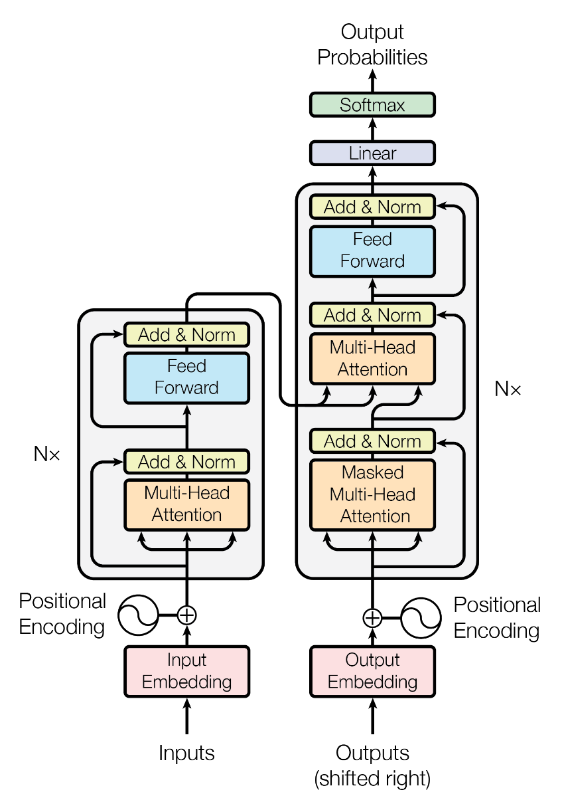
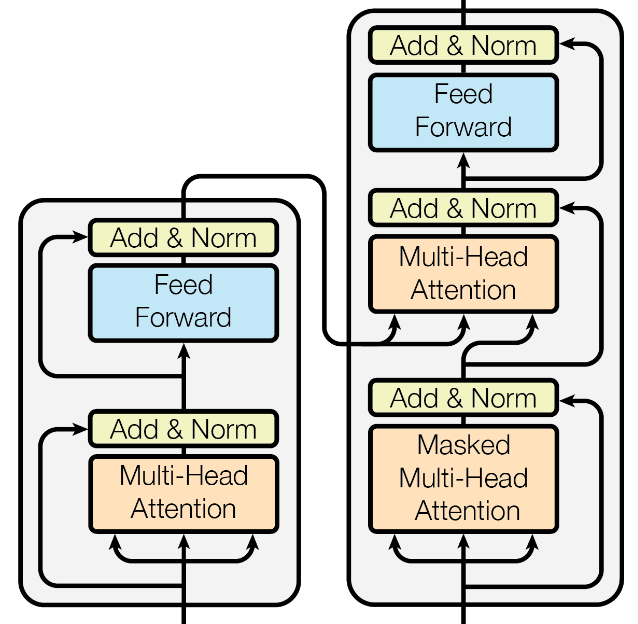

# Parallel Encoder-Decoder model [WIP readme]
> NB: LaTeX here is optimized for Github's Markdown, so please view it on Github.

Current SOTA LLMs are all decoder-only models. Here, a new encoder-decoder transformer variant is presented where encoder and decoder run in parallel, unlike the typical implementation where they run serially (encoder first and decoder after).

## Motivations

The largest motivation originates from the paradox posed by the atttention mechanism attending latent representation of prior tokens when they are solely optimized for next token prediction. More concretely, if the latent representation $\mathbf{h}^{l}_{t}$ of token $\mathbf{x}_{t}$ is trying to predict the next token $\mathbf{x}_{t+1}$, then $\mathbf{h}^{l}_{t}$ shouldn't be **entirely** useful to the latent representation $\mathbf{h}^{l}_{t+1}$ of the next token (and any $\mathbf{h}^{l}_{z}$ where $z > t$), which is trying to predict $\mathbf{x}_{t+2}$. Yet, the attention mechanism makes $\mathbf{h}^{l}_{t}$ attend to all $\mathbf{h}^{l}_{z}$ where $z < t$. Now, we know empirically that the earlier layers of a decoder-only transformer are less focused on next-token prediction and more on just general understanding, so latent representation of earlier tokens at these layers are plausibly more useful to later tokens. Though there is a singular objective function (next token prediction), the attention mechanism implitictly introduces another one: general (contextual) understanding. But it's reasonable to believe that they become less useful at later layers as latent representation become increasingly attuned to next token prediction. If anything, attending to prior tokens could hurt performance at these layers. Therefore, separating the dual objetive functions could improve performance.

In a encoder-decoder model, this dual nature is separated. The encoder handles general understanding and decoder handles prediction. But the canonical implementation has them running serially. Instead, the model presented here implements them in parallel. The parallel implementation also permits an additional loss on the encoder.

## Architecture

At the high level, the architecture re-implements the canonical encoder-decoder model but in a parallel way. Furthemore, novel components were added to exploit the dual & parallel encoder-decoder representation.

### Encoder-Decoder

The canonical encoder-decoder model looks roughly like this

<figure>
    
    <figcaption><em>From the Attention is All You Need paper. The modern encoder-decoder remains largely the same as the one above, with the major difference being the relocation of Add & Norm component to before attention and feed forward blocks.</em></figcaption>
</figure>


The parallelization simply has the following as a single layer that's stacked $N$ times.

<figure>
    
    <figcaption><em>Just like the one before, Add & Norm should be moved to before each block.</em></figcaption>
</figure>


This layer haves two inputs, one for the encoder and decoder, and two outputs, one for the encoder and decoder. The decoder and encoder latent representations interact only at the second attention block on the decoder side. For a better exposition, this is the pseudocode

```
def encoder_decoder_layer_forward(encoder_x, decoder_x):
    # encoder block
    encoder_x = encoder_x + encoder_multi_attn_head(
        encoder_layer_norm_1(encoder_x)
    )
    encoder_x = encoder_x + encoder_feed_forward(encoder_layer_norm_2(encoder_x))
    
    # decoder block
    decoder_x = decoder_x + decoder_multi_attn_head(
        decoder_layer_norm_1(decoder_x)
    )
    decoder_x = decoder_x + cross_multi_attn_head(
        encoder_cross_layer_norm(encoder_x), decoder_cross_layer_norm(decoder_x)
    )
    decoder_x = decoder_x + decoder_feed_forward(decoder_layer_norm_2(decoder_x))
    return encoder_x, decoder_x
```

The `decoder_x` input of the first layer is obtained from a feed forward layer on the model input embedding.

### Encoder loss

In the canonical decoder-encoder model, the loss function is evaluated over the decoder's output (itself being a function of the encoder's output). In this implementation, we end up with two outputs, one from the encoder and one from decoder. The loss over the decoder output constitutes the canonical loss function, but the presence of a encoder output permits something. In this case, it was used to update the token and positional embedding. The idea here is similar to weight tying of the output layer with token embedding. Weigh tying both 1) increases update frequencies and magnitude and 2) kinda compresses an entire forward pass into embedding weights, thus permitting hidden layers to do more complex representation. The same 1) and 2) can be achieved with the encoder loss described as following. Given the original embedding ${E}$ (token + positional) that is the input to the first hidden layer, you calculate the cumulative average along the token dimension (i.e. T dimension). Finally, you calculate an dis-affinity score between the cumulative average and the encoder output, and use that as the encoder loss. Stated more formally, you have

$$
out_{enc} \coloneqq \text{encoder output of the last layer} \\
E \coloneqq \text{model input embedding, comprising of token and positional embedding} \\
E_{avg\_sum} = CumAvg(E)\quad \text{where}\quad E_{i,j} = CumAvg(E_{1:i,j}) = \frac{1}{i} \sum_{z}^{i}E_{z,j} \\
encoder\_loss\ = disaffinity\_score(out_{enc}, E_{avg\_sum})
$$

Two disaffinity scores are experimented. One is euclidian distance, and the other is cosine similarity. Cosine similarity needs to be normalize for 0 to represent the most similarity. So the encoder loss with euclidian distance is just

$$encoder\_loss\ = \|out_{enc} - E_{avg\_sum} \|_2$$

and the encoder loss with cosine similarity is

$$encoder\_loss\ = 1- \frac{cosine\_similarity(out_{enc}, E_{avg\_sum}) + 1}{2}$$

#### Positional loss in decoder

TODO

## Analysis/experiments

TODO

## Conclusions

TODO