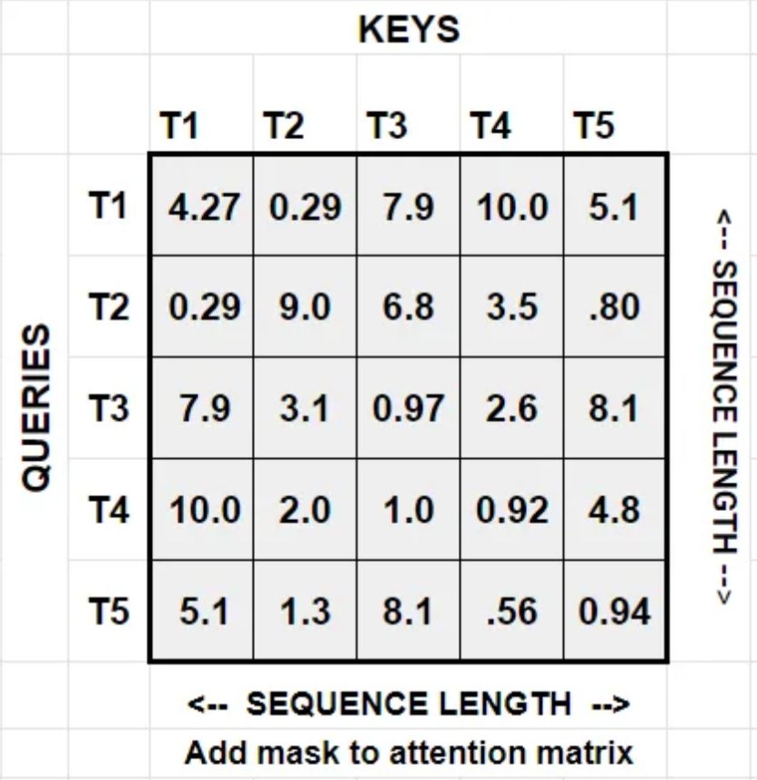
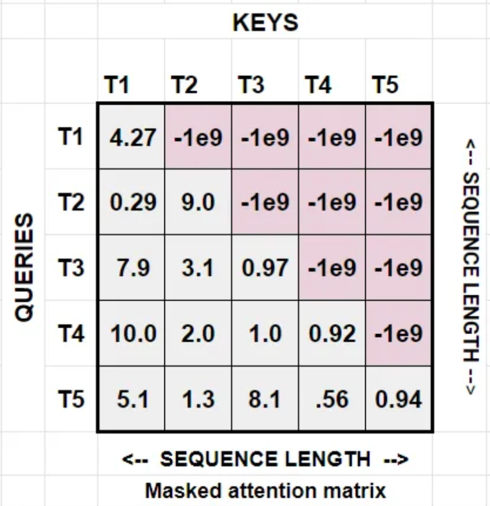

# Future Attention Transformer [WIP readme]
> NB: LaTeX here is optimized for Github's Markdown, so please view it on Github.

Decoder-only transformer models apply a causal mask to enable parallel training with teacher forcing. But that wastes half of the attention matrix. What if you could use the full attention matrix while respecting the temporal causality? The model presented here demonstrates a way to do it.

## Motivations

In the canonical decoder's multi attention head, an attention matrix is calculated for every head

and an upper-right triangular mask is applied on it to respect temporal causality

However, it seems wasteful to throw away so much information. Instead, we can ask the model to "predict" the masked upper right triangle part of the attention by having it compute the output contribution from it. In other words, asumming that $out_{encoder}$ is the output of the attention operation if no mask were applied to the attention matrix and $out_{decoder}$ is the output if a mask were applied, then we are asking the model to compute $out_{mask} = out_{encoder} - out_{decoder}$. Once $out_{mask}$ is computed, its addition to $out_{decoder}$ becomes the final output of the attention operation. Then, we can also calculate an attention loss on $out_{mask}$ since we know the true $out_{mask}$. At the end of the forwad pass, all attention losses are aggregated and added to the model's final loss.

## Architecture

At the high-level, the architecture is just the canonical decoder-only transformer but with a modified multi attention head block that also predicts the upper right triangle's output contribution. Finally, an attention loss is computed for every predicted attention matrix and that loss is added to the final model loss.

### Multi Attention Head

In the regular attention head, attention works by computing $Q$, $K$, and $V$ tensors. In order to predict the upper right triangle, we need $K_{future}$ and $V_{future}$. Then, you compute a future attention matrix $Attn_{future} = Q \cdot K_{future}$ and a future attention out $out_{future} = Attn_{future} \cdot  V_{future}$, then the final output is $out = out_{present} + out_{future}$ where $out_{present}$ is just the normal output.

Then, the attention loss is computed with $out_{future}$ and the true out future, which can be trivially computed.

## Analysis/experiments

TODO

## Conclusions

TODO