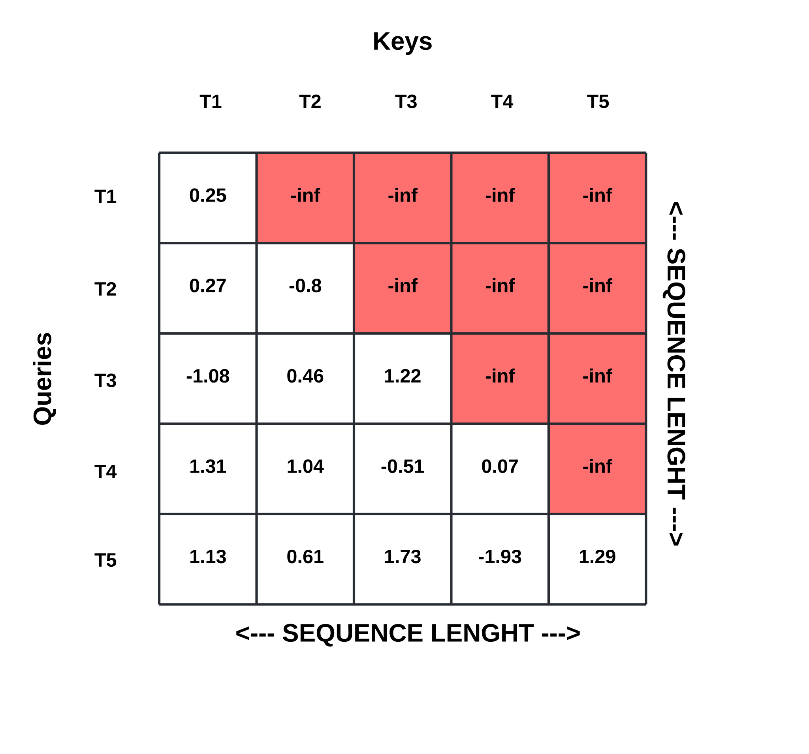

# Future Attention Transformer [WIP readme]
> NB: LaTeX here is optimized for Github's Markdown, so please view it on Github. Also, Safari does not render Github's LaTeX and some SVG files well, so Chrome is advised.

Decoder-only transformer models apply a causal mask in attention layers to enable parallel training with teacher forcing. However, the causally masked part of the attention matrix contains good signals on the affinities between present and future tokens. This project investigates how the masked part can be leveraged to improve model performance while still respecting temporal causality.

## Motivations

In the canonical decoder-only transformer, the attention layer computes an attention matrix $A$ for each head, like the figure below.

<div align="center">
  
</div>

Because transformer models are trained in a parallel way, a causal mask $M$ must be applied to the attention matrix $A$ to prevent the model from peeking at future tokens and thus from cheating. Stated more formally,

$$
\begin{aligned}
& A_{causal}[i,j] = 
\begin{cases} 
A[i,j] & \text{if } M[i,j] = 1 \\
-\infty & \text{if } M[i,j] = 0
\end{cases} \\
\end{aligned}
$$

The result of masking is illustrated in the figure below (the masked positions are depicted with red squares).

<div align="center">
  
</div>

Afterwards, the following concludes the attention mechanism

$$
\begin{aligned}
& out_{causal} = softmax(A_{causal}) \cdot V \\
\end{aligned}
$$

**Note:** although other subsequent operations on $out_{causal}$ usually follow (e.g. dropout, residual projection, etc.), those are not of concern here.

Before proceeding, let's identify two subsets of the original $A$

$$
\begin{aligned}
& A_{unmasked}[i,j] = A[i,j] \text{ where } (i,j) \in \\{ (i,j) \mid M[i,j] = 1 \\} \\
& A_{masked}[i,j] = A[i,j] \text{ where } (i,j) \in \\{ (i,j) \mid M[i,j] = 0 \\}
\end{aligned}
$$

Now, the masked part $A_{masked}$ contains good signals on the affinities between present and future tokens. If no mask $M$ were applied, subsequent operations would transform these affinities into $out_{masked}$, like so              

$$
\begin{aligned}
& Softmax\\\_A = softmax(A) \\
& Softmax\\\_A_{masked} = Softmax\\\_A[A_{masked}.indices] \\
& out_{masked} = Softmax\\\_A_{masked} \cdot V \\
\end{aligned}
$$

Presumably, the model performance would improve if it could make use of $out_{masked}$ (i.e. add it to $out_{causal}$). Since the true $out_{masked}$ can't be used because of masking, the model can instead predict $out_{masked}$, thus indirectly predicting $A_{masked}$ as well. From the $out_{masked}$ predictions, a new **future attention loss** can be formulated, with the true $out_{masked}^{\*}$ (which can be easily derived) as ground truth. Furthermore, instead of predicting the full $out_{masked}$, the model can predict part of it, which is equivalent to predicting a subset of $A_{masked}$. Therefore, rather than predicting $out_{masked}$ and $A_{masked}$, the predictive targets become their subsets $out_{future}$ and $A_{future}$, respectively. Then, let $future\\\_dim$ be the scalar hyperparameter that defines how many masked values in $A_{masked}$ to predict, per token. Stated formally, 

$$
\begin{aligned}
& A_{future}[i,j] = A_{masked}[i,j] \text{  where  } (i,j) \in \\{ (i,j) \mid i < j \leq min(i + future\\\_dim, context\\\_size) \\} \\\\
& A_{omni} = A_{future} \cup A_{unmasked} \\\\[0.4cm]
& Softmax\\\_A_{omni} = softmax(A_{omni}) \\
& Softmax\\\_A_{future} = Softmax\\\_A_{omni}[A_{future}.indices] \\
& out_{future} = Softmax\\\_A_{future} \cdot V \\
\end{aligned}
$$

In the figure below, for instance, the model considers the affinity of each present token to the next two future tokens (the blue squares) while the rest is masked away (the red squares). Here, $future\\_dim = 2$.

<div align="center">
  
</div>

**Note:** $future\\_dim$ only represents the max value. In fact, in the figure above, $T_4$ can only predict $q_4k_5$.

Here's a visual guide for all the different attention matrices defined thus far.

<div align="center">
  
</div>

(The reason for the explicit definition of all these different attention matrices is the indexing-heavy nature of the implementation presented below)

Lastly, because the softmax of the attention matrix is later matrix multiplied with $V$ to produce the attention output $out$

$out = softmax(A) \cdot V$

then $V$ also needs to be adjusted to match $Softmax\\\_A_{future}$'s shape.

## Architecture

At the high-level, the architecture consists of a canonical decoder-only transformer with a modified multi-headed attention block that also predicts $out_{future}$. A new loss is created from all $out_{future}$ predictions, in addition to the regular next token prediction loss.

### Future (Multi-headed) Attention

Remember that the attention mechanism requires three operands: $Q$, $K$, and $V$. In predicting $out_{future}$, as many of these three operands as possible should be reused. In this case, $Q$ can be reused but different $K$ and $V$ are needed to match $A_{future}$ and $Softmax\\\_A_{future}$'s shape, respectively. Let's call these $K_{future}$ and $V_{future}$. There are many ways to construct $K_{future}$ and $V_{future}$, but a simple way is to have them as model parameters, not computed tensors, of shape $(n\\_head \times context\\_size \times head\\_size)$. Then, the forward pass of an attention block becomes

|||
|----------|----------|
| $$A = Q \cdot K^{T}$$ | $A_{future} = Q \cdot K_{future}^{T}$ |
| $$A_{unmasked} = A[A_{unmasked}.indices]$$ | |
| $$A_{omni} = A_{unmasked} \cup A_{future}$$ | |
| $$Softmax\\\_A_{omni} = softmax(A_{omni})$$ | |
| $$Softmax\\\_A_{unmasked} = Softmax\\\_A_{omni}[A_{unmasked}.indices]$$ | $$Softmax\\\_A_{future} = Softmax\\\_A_{omni}[A_{future}.indices]$$ |
| $$out_{unmasked} = Softmax\\\_A_{unmasked} \cdot V$$ | $$out_{future} = Softmax\\\_A_{future} \cdot V_{future}$$ |
| $$out_{omni} = out_{future} + out_{unmasked}$$ | |

<div align="center">
  <em>The two columns serve to highlight symmetrical operations. The order of operations goes from top to bottom</em>
</div>
<br>

Note that $A_{unmasked}$ and $A_{future}$ have different shapes, so merging the two requires padding operations that are hard to express in LaTeX. Also, note that $out_{unmasked} \neq out_{causal}$ because the former's softmax is on the union of $A_{unmasked}$ and $A_{future}$.

Then, deriving the true $out_{future}^{*}$ simply becomes

$$
\begin{aligned}
& A_{omni}^{\*} = A[A_{unmasked}.indices \cup A_{future}.indices]  \\
& Softmax\\\_A_{omni}^{\*} = softmax(A_{omni}^{\*})  \\
& Softmax\\\_A_{future}^{\*} = Softmax\\\_A_{omni}^{\*}[A_{future}.indices]  \\
& out_{future}^{\*} = Softmax\\\_A_{future}^{\*} \cdot V
\end{aligned}
$$

The future attention loss is computed between $out_{future}$ and detached $out_{future}^{*}$, for every attention head block. Two types of loss are considered. One is mean squared error, and the other is cosine dissimilarity. Cosine dissimilarity is cosine similarity normalized such that zero represents most similarity and 1 most dissimilarity. So the future attention loss with MSE is given by

$$future\\\_attn\\\_loss = MSE(out_{future}, out_{future\\_detached}^{*})$$

and with cosine dissimilarity is given by

$$future\\\_attn\\\_loss = 1- \frac{cosine\\\_similarity(out_{future}, out_{future\\_detached}^{*}) + 1}{2}$$

Once all $future\\\_attn\\\_loss$'s are computed, it gets aggregated with a mean and added to the model loss.

## Results

> All training runs below were done on a wikipedia dataset for 9k steps on a single A100 GPU, unless otherwise stated.
> 
> Implementation of decoder-only transformer model (baseline) can be found in the `baseline_transformer` directory in this repo

The MSE future attention loss outperformed cosine dissimilarity in validation loss and matched it in train loss. Both had $future\\\_dim = 50$.

<div>
  <div style="display: flex; flex-wrap: wrap; justify-content: space-between; align-items: flex-start; align-content: flex-start;">
    
    
    
  </div>
    <div align="center">
      <em>Safari may not render the charts above. Chrome is advised.</em>
    </div>
</div>
<br>

|   | Train loss | Val loss | Future attention loss |
|---|----------|----------|----------|
| **future_dim = 50 Cosine** [(config)](#future_dim--50-cosine) | 3.017 | 3.423| 0.2589 |
| **future_dim = 50 MSE** [(config)](#future_dim--50-mse) | 3.017 | **3.419** | 0.07681 |


With MSE future attention loss, the performances of $future\\\_dim = 50$ and $future\\\_dim = 100$ were compared. Intuitively, larger $future\\\_dim$ should result in better performance, but $future\\\_dim = 100$ underperformed across the board.

<div>
  <div style="display: flex; flex-wrap: wrap; justify-content: space-between; align-items: flex-start; align-content: flex-start;">
    
    
    
  </div>
    <div align="center">
      <em>Safari may not render the charts above. Chrome is advised.</em>
    </div>
</div>
<br>

|   | Train loss | Val loss | Future attention loss |
|---|----------|----------|----------|
| **future_dim = 50 MSE** [(config)](#future_dim--50-mse) | **3.017** | **3.419** | 0.07681 |
| **future_dim = 100 MSE** [(config)](#future_dim--100-mse) | 3.025 | 3.421 | 0.08633 |


Finally, the new model was compared with a canonical decoder-only transformer (baseline). There were two versions of the baseline: "baseline" and "smaller baseline". "baseline" had more parameters than the new model. "smaller baseline" had fewer parameters. The new model outperformed "baseline" in validation loss but underperformed "smaller baseline".

<div>
  <div style="display: flex; flex-wrap: wrap; justify-content: space-between; align-items: flex-start; align-content: flex-start;">
    
    
  </div>
    <div align="center">
      <em>Safari may not render the charts above. Chrome is advised.</em>
    </div>
</div>
<br>

|   | Train loss | Val loss | Size (params) |
|---|----------|----------|----------|
| **future_dim = 50 MSE** [(config)](#future_dim--50-mse) | 3.017 | 3.419 | 15,817,248 |
| **baseline** [(config)](#baseline) | **2.937** | 3.424 | 16,036,800 |
| **smaller baseline** [(config)](#smaller-baseline) | 2.958 | **3.416** | 15,441,192 |

## Next steps

These are some improvements to look forward to:
- have $K_{future}$ and $V_{future}$ be computed values (just like $Q$, $K$, and $V$). Should also do this in a parameter count efficient way (ideally reusing or closely deriving from $K$ and $V$)
- instead of MSE and cosine dissimilarity, consider other loss types
- try bigger models, at least GPT-2 size
- run training for longer to observe long-term behavior
- try different datasets
- try it on non-language tasks

## Conclusions

This project was inspired by an accident where I forgot to apply the causal mask to a model. My overjoy for the spectacular model performance quickly evaporated upon the discovery of the bug. Yet, I wondered if there were a way to respect temporal causality while still taking advantage of the full attention matrix. Unfortunately, the results of this project do not corroborate this idea.

I believe the results were poor for two reasons: 1) bad $K_{future}$ and $V_{future}$ construction, and 2) bad future attention loss formulation. For 1), remember that the attention mechanism only makes sense when using in-context information, which is why $Q$, $K$, and $V$ are all computed values. However, the parametrization of $K_{future}$ and $V_{future}$ deprive them of in-context information. Therefore, $K_{future}$ and $V_{future}$ probably have to compress all possible $K$ and $V$ values into their weights and/or heavily rely on $Q$. Furthermore, perhaps it may not even make sense to predict the masked attention with another attention operation.

For 2), the future attention loss uses $out_{future}^{\*}$ as ground truth, which is basically a hidden state and thus very transient. Moreover, since different model layers specialize in different things, the $out_{future}^{\*}$ of each attention block is probably very different from the others, further aggravated by $out_{future}^{\*}$'s transience. All of this, coupled with the future attention loss being computed for all $L$ layers, means that, instead of a single objective function, there are essentially $L$ orthogonally different object functions. Indeed, all the future attention loss charts either show increasing loss or some equilibrium point, and none showed convergence towards zero loss.

The first reason is amenable to change, but the second one is probaly inevitable. Alas, the principal limitation is my personal compute budget, so this project cannot avail itself of further analysis and experimentation.

---
## Appendix
### Run configs
#### "future_dim = 50 Cosine"
```
{'lr': 0.0009,
 'beta1': 0.9,
 'beta2': 0.95,
 'min_lr': 9e-05,
 'decay_lr': True,
 'est_steps': 200,
 'batch_size': 50,
 'train_steps': 9000,
 'est_interval': 500,
 'model_config': {'n_head': 9,
                  'n_embed': 144,
                  'n_layer': 28,
                  'use_bias': False,
                  'end_layer': 28,
                  'future_dim': 50,
                  'start_layer': 1,
                  'context_size': 200,
                  'dropout_rate': 0,
                  'use_future_attn_loss': True,
                  'future_attn_loss_type': 2,
                  'future_attn_loss_coeff': 1,
                  'detach_future_ground_truth': True},
 'warmup_iters': 300,
 'weight_decay': 0.1,
 'lr_decay_iters': 700000,
 'gradient_accumulation_steps': 16}
```
#### "future_dim = 50 MSE"
```
{'lr': 0.0009,
 'beta1': 0.9,
 'beta2': 0.95,
 'min_lr': 9e-05,
 'decay_lr': True,
 'est_steps': 200,
 'batch_size': 50,
 'train_steps': 9000,
 'est_interval': 500,
 'model_config': {'n_head': 9,
                  'n_embed': 144,
                  'n_layer': 28,
                  'use_bias': False,
                  'end_layer': 28,
                  'future_dim': 50,
                  'start_layer': 1,
                  'context_size': 200,
                  'dropout_rate': 0,
                  'use_future_attn_loss': True,
                  'future_attn_loss_type': 1,
                  'future_attn_loss_coeff': 1,
                  'detach_future_ground_truth': True},
 'warmup_iters': 300,
 'weight_decay': 0.1,
 'lr_decay_iters': 700000,
 'gradient_accumulation_steps': 16}
 ```
#### "future_dim = 100 MSE"
```
{'lr': 0.0009,
 'beta1': 0.9,
 'beta2': 0.95,
 'min_lr': 9e-05,
 'decay_lr': True,
 'est_steps': 200,
 'batch_size': 50,
 'train_steps': 9000,
 'est_interval': 500,
 'model_config': {'n_head': 9,
                  'n_embed': 144,
                  'n_layer': 28,
                  'use_bias': False,
                  'end_layer': 28,
                  'future_dim': 100,
                  'start_layer': 1,
                  'context_size': 200,
                  'dropout_rate': 0,
                  'use_future_attn_loss': True,
                  'future_attn_loss_type': 1,
                  'future_attn_loss_coeff': 1,
                  'detach_future_ground_truth': True},
 'warmup_iters': 300,
 'weight_decay': 0.1,
 'lr_decay_iters': 700000,
 'gradient_accumulation_steps': 16}
```
#### "baseline"
```
{'lr': 0.0009,
 'beta1': 0.9,
 'beta2': 0.95,
 'min_lr': 9e-05,
 'decay_lr': True,
 'est_steps': 200,
 'batch_size': 50,
 'train_steps': 9000,
 'est_interval': 500,
 'model_config': {'n_head': 10,
                  'n_embed': 160,
                  'n_layer': 26,
                  'use_bias': False,
                  'context_size': 200,
                  'dropout_rate': 0},
 'warmup_iters': 300,
 'weight_decay': 0.1,
 'lr_decay_iters': 700000,
 'gradient_accumulation_steps': 16}
 ```
#### "smaller baseline"
```
{'lr': 0.0009,
 'beta1': 0.9,
 'beta2': 0.95,
 'min_lr': 9e-05,
 'decay_lr': True,
 'est_steps': 200,
 'batch_size': 50,
 'train_steps': 9000,
 'est_interval': 500,
 'model_config': {'n_head': 12,
                  'n_embed': 156,
                  'n_layer': 26,
                  'use_bias': False,
                  'context_size': 200,
                  'dropout_rate': 0},
 'warmup_iters': 300,
 'weight_decay': 0.1,
 'lr_decay_iters': 700000,
 'gradient_accumulation_steps': 16}
 ```